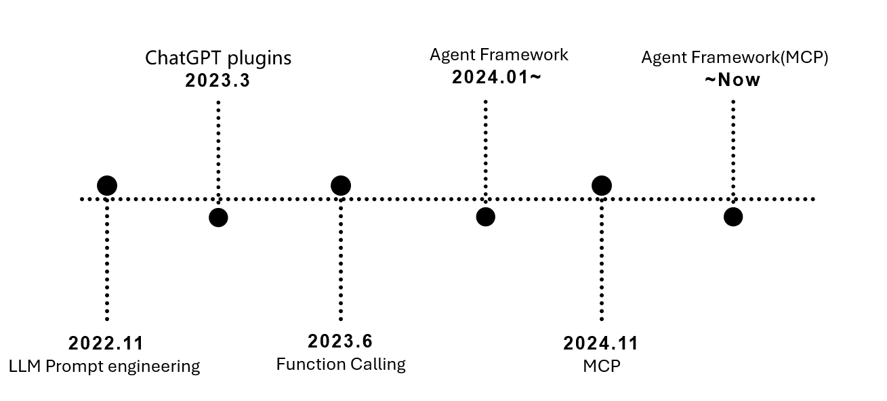
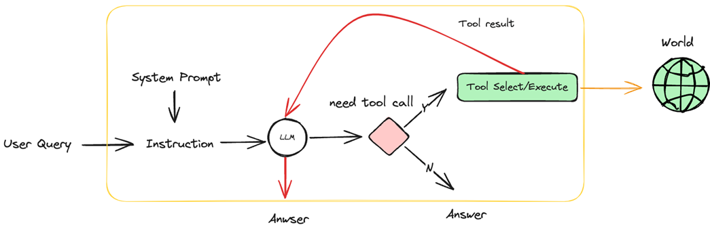

# Agent工具系统

## 概述

Agent Tool是智能代理系统的核心组件之一，作为LLM的"手与眼"，通过外部工具扩展模型能力边界，解决纯文本生成无法完成的操作。

### 核心概念

- **LLM作为"大脑"**：负责决策规划和推理
- **Tools作为"执行单元"**：完成具体操作，形成"感知-决策-执行"闭环
- **Tool的本质**：Agent可以调用的功能单元，是Agent与外部世界交互的接口
- **结构化输入输出**：具有明确的输入输出规范，封装了特定的功能或能力

### 功能特性

1. **可调用单元**：为Agent提供可调用的功能模块
2. **环境交互接口**：实现Agent与外部环境的交互
3. **能力封装**：封装特定功能（如API调用、计算等）
4. **结构化规范**：遵循清晰的输入输出规范

## 发展时间线

Agent Tool的实现经历了多个发展阶段：



- **2022.11**: LLM Prompt Engineering - GPT-3.5发布，基于GPT-3优化
- **2023.3**: ChatGPT Plugins - 插件系统引入
- **2023.6**: Function Calling - 原生函数调用支持
- **2024.01~**: Agent Framework - 各种Agent框架兴起
- **2024.11**: MCP (Model Context Protocol) - 标准化协议发布

### 原生支持

主要LLM提供商都提供了原生支持：
- **OpenAI**: GPT系列
- **Anthropic**: Claude系列

### 框架支持

- LangChain
- OpenAI Agent SDK  
- Microsoft AutoGen Studio
- 等等...

## 实现方式

### 1. Prompt Engineering方式



通过精心设计的提示词模板来实现工具调用：

```markdown
You are a helpful assistant that can use tools to answer questions.

You have access to the following tools:
1. get_current_time: Gets the current time
2. get_weather: Gets the current weather for a specified city

To use a tool, write your response in the following format:

<tool>tool_name(parameters)</tool>

<answer>
Your final answer incorporating the tool result.
</answer>
```

**示例对话流程**：
```
User: How is the weather in New York?
```
```
AI: <tool>get_weather("New York")</tool>
```
```
Tool get_weather: Weather in New York: Sunny, Temperature: 26°C
```
```
AI: <answer>
The weather in New York is currently sunny with a temperature of 26°C.
</answer>
```

### 2. OpenAI Completion API方式

使用OpenAI的原生Function Calling功能：

```python
# 定义工具
tools = [
    {
        "type": "function",
        "function": {
            "name": "get_weather",
            "description": "Get current weather for a city",
            "parameters": {
                "type": "object",
                "properties": {
                    "city": {
                        "type": "string",
                        "description": "City name"
                    }
                },
                "required": ["city"]
            }
        }
    }
]

# API调用
response = client.chat.completions.create(
    model="gpt-4",
    messages=[{"role": "user", "content": "What's the weather in New York?"}],
    tools=tools,
    tool_choice="auto"
)
```

### 3. 框架支持方式

#### LangChain框架

```python
from langchain.agents import create_openai_tools_agent
from langchain.tools import BaseTool

class WeatherTool(BaseTool):
    name = "get_weather"
    description = "Get current weather for a city"
    
    def _run(self, city: str) -> str:
        # 实现天气查询逻辑
        return f"Weather in {city}: Sunny, 26°C"

# 创建代理
agent = create_openai_tools_agent(
    llm=llm,
    tools=[WeatherTool()],
    prompt=prompt
)
```

#### OpenAI Agent SDK

```python
from openai import OpenAI
from openai.agents import Agent

client = OpenAI()

# 定义工具函数
def get_weather(city: str) -> str:
    return f"Weather in {city}: Sunny, 26°C"

# 创建代理
agent = Agent(
    name="WeatherAgent",
    instructions="You are a helpful weather assistant",
    tools=[get_weather],
    model="gpt-4"
)
```

## 工具特性

### 输入输出规范

所有工具都遵循明确的输入输出规范：

- **输入验证**：确保输入参数符合预期格式
- **输出标准化**：返回结构化的数据格式
- **错误处理**：提供清晰的错误信息和处理机制

### 可扩展性

- **模块化设计**：每个工具都是独立的功能模块
- **组合使用**：多个工具可以组合使用解决复杂问题
- **动态加载**：支持运行时动态加载新工具

### 安全性考虑

- **权限控制**：限制工具的访问权限
- **输入验证**：防止恶意输入
- **执行隔离**：确保工具执行的安全性

## 最佳实践

1. **明确工具职责**：每个工具应该有明确的单一职责
2. **标准化接口**：遵循统一的接口规范
3. **完善文档**：提供详细的工具说明和使用示例
4. **错误处理**：实现健壮的错误处理机制
5. **性能优化**：确保工具执行效率
6. **安全考虑**：实施适当的安全措施

## 总结

Agent Tool是实现智能代理能力扩展的关键技术，通过不同的实现方式（Prompt Engineering、原生API、框架支持），为LLM提供了与外部世界交互的能力。随着技术的发展，工具系统正朝着更加标准化、安全化和智能化的方向发展。