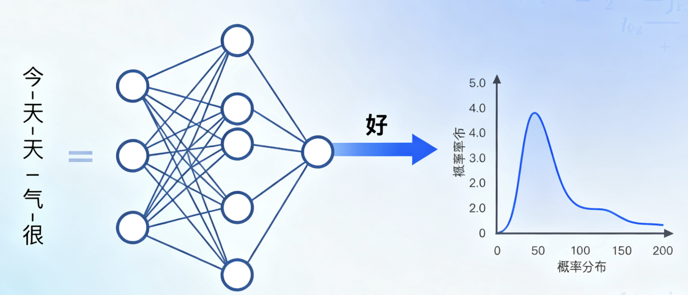
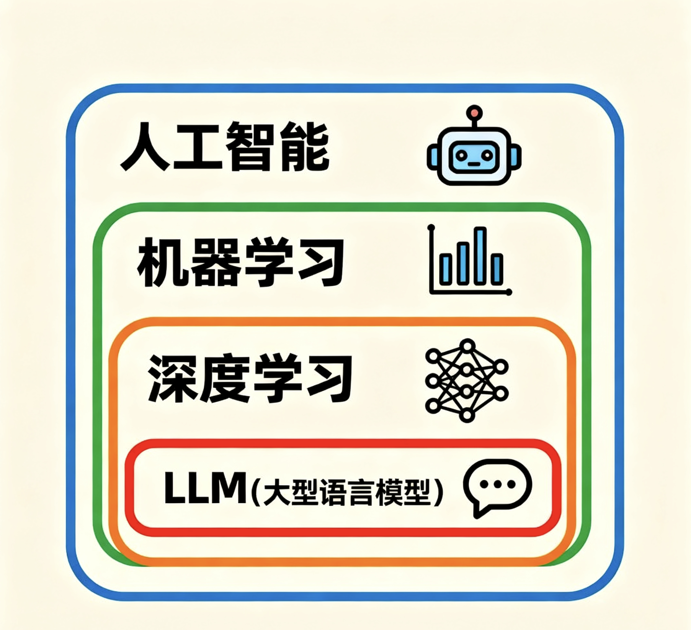

# LLM基础概念与原理

## 什么是大语言模型（LLM）

大语言模型（Large Language Model，简称LLM）是一种基于深度学习的人工智能模型，专门用于理解和生成人类语言。这些模型通过在海量文本数据上进行训练，学习语言的模式、结构和语义，从而能够执行各种自然语言处理任务。

## 技术基础

### Autoregressive generation 自回归生成

自回归生成是指模型根据之前的文本序列，生成下一个可能的词。这是一种基于概率的生成模型，通过计算每个词在给定上下文的条件下的概率分布，选择概率最高的词作为下一个生成的词。

### Transformer架构
LLM主要基于Transformer架构，其核心组件包括：
- **自注意力机制**：允许模型关注输入序列中的不同位置
- **多头注意力**：并行处理多个注意力表示
- **位置编码**：为序列中的每个位置提供位置信息
- **前馈网络**：提供非线性变换能力

### 预训练范式
- **自监督学习**：通过预测下一个词来学习语言表示
- **掩码语言建模**：预测被掩盖的词汇
- **因果语言建模**：从左到右生成文本

## LLM于其他AI技术的关系

- **人工智能（AI）** 是最宽泛的概念，指让机器模拟人类智能的所有技术和研究，包含了实现智能的各种方法。
- **机器学习（ML）** 是人工智能的一个重要分支，通过算法让机器从数据中学习规律，自动改进性能，是实现人工智能的核心技术之一。
- **深度学习（DL）** 是机器学习的一个子领域，基于多层神经网络模拟人脑结构，能处理更复杂的数据（如图像、语言），是当前机器学习中最热门的技术。
- **大语言模型（LLM）** 则是深度学习的一个具体应用，通过大规模文本数据训练的深度神经网络，专门用于理解和生成人类语言（如 ChatGPT）。

