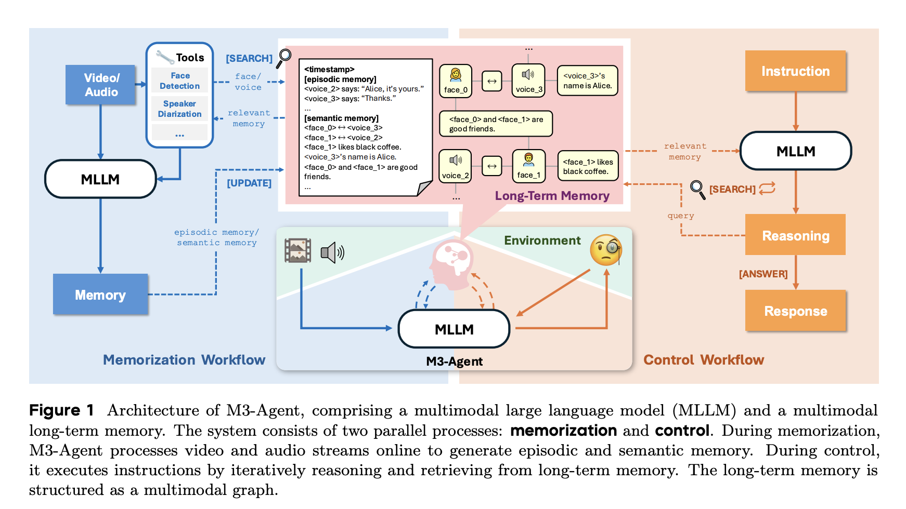
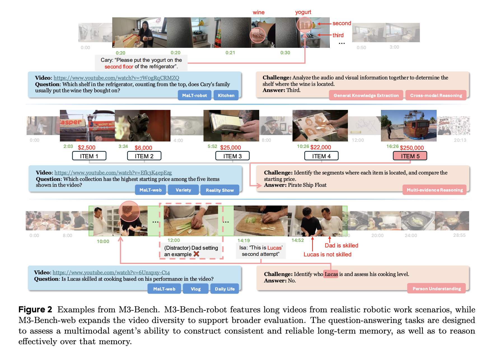

# M3-Agent：具有长期记忆的多模态智能体

## 论文信息

- **论文标题**: Seeing, Listening, Remembering, and Reasoning: A Multimodal Agent with Long-Term Memory
- **作者**: Lin Long, Yichen He, Wentao Ye, Yiyuan Pan, Yuan Lin, Hang Li, Junbo Zhao, Wei Li
- **发表年份**: 2024年
- **机构**: 字节
- **论文链接**: https://arxiv.org/abs/2508.09736
- **arXiv编号**: 2508.09736

## 摘要

本文介绍了M3-Agent，一个配备长期记忆的新型多模态智能体框架。与人类类似，M3-Agent能够处理实时的**视觉和听觉输入**来构建和更新情节记忆和语义记忆，逐步积累世界知识。其记忆以实体为中心、多模态的方式组织，能够实现对环境更深入和一致的理解。

## 核心贡献与创新点

### 1. 多模态感知能力
- **视觉处理**: 能够实时处理和理解视觉输入信息
- **听觉处理**: 具备音频信息的处理和理解能力
- **多模态融合**: 将视觉和听觉信息进行有效整合

### 2. 长期记忆机制
- **情节记忆**: 存储和管理具体的经历和事件
- **语义记忆**: 积累和组织抽象的世界知识
- **动态更新**: 能够根据新的输入持续更新记忆内容

### 3. 实体中心的记忆组织
- **实体识别**: 以实体为核心组织记忆信息
- **关系建模**: 建立实体间的关系和连接
- **多模态表示**: 每个实体包含多种模态的信息

### 4. 推理与理解能力
- **环境理解**: 对复杂环境进行深入理解
- **一致性推理**: 保持跨时间和模态的推理一致性
- **知识积累**: 通过经验不断丰富知识库

## 方法论与技术细节

### 系统架构
M3-Agent采用模块化设计，主要包含以下核心组件：

#### 感知模块
- **视觉编码器**: 处理图像和视频输入
- **音频编码器**: 处理语音和音频信号
- **多模态融合**: 整合不同模态的信息

#### 记忆系统
- **情节记忆库**: 存储具体的经历和事件序列
- **语义记忆库**: 维护抽象的概念和知识
- **实体图谱**: 以图结构组织实体及其关系

#### 推理引擎
- **记忆检索**: 根据当前情境检索相关记忆
- **推理生成**: 基于记忆和当前输入进行推理
- **决策制定**: 生成合适的行动或回应

### 记忆管理机制

#### 记忆编码
- 将多模态输入转换为统一的记忆表示
- 提取关键实体和关系信息
- 生成时间戳和上下文标记

#### 记忆存储
- 根据重要性和相关性决定存储策略
- 维护记忆的层次结构和索引
- 实现高效的记忆压缩和去重

#### 记忆检索
- 基于相似性和关联性检索相关记忆
- 支持多模态查询和检索
- 动态调整检索策略和权重

#### 记忆更新
- 根据新信息更新现有记忆
- 解决记忆冲突和不一致性
- 实现记忆的遗忘和淡化机制

### 训练方法 (Training)

M3-Agent采用强化学习方法进行优化训练，虽然记忆化和控制在概念上由单一模型处理，但为了达到最优性能，研究团队训练了两个独立的策略模型。

#### 双模型训练策略

##### 模型初始化
- **记忆模型**: 使用Qwen2.5-Omni初始化，这是一个支持视觉和音频输入的先进开源多模态模型，专门负责记忆化任务
- **控制模型**: 使用Qwen3初始化，这是一个具有强大推理能力的开源大语言模型，专门负责控制和推理任务
- **设计理念**: 记忆化需要强大的多模态理解能力，而控制需要强大的推理能力，因此采用不同的基础模型

#### 训练数据集
- **数据来源**: 内部视频数据集，具有模型训练许可
- **数据规模**: 500个长视频，对应26,943个30秒片段，2,736个问答对
- **标注标准**: 遵循与M3-Bench-web数据集相同的标注标准

#### 记忆化训练 (Memorization Training)

##### 模仿学习阶段
- **目标**: 提高模型生成期望记忆的能力
- **方法**: 对Qwen2.5-Omni-7b进行模仿学习，创建memory-7b-sft模型
- **数据构建**: 构建高质量合成演示数据集

##### 三阶段记忆标注过程

**1. 情节记忆合成**
- 采用混合标注策略，联合使用Gemini-1.5-Pro和GPT-4o
- GPT-4o提供帧级线索作为先验信息
- Gemini-1.5-Pro基于这些线索生成更丰富的叙述摘要
- 两个输出合并形成比单独使用任一模型更丰富的叙述摘要

**2. 身份等价检测**
- 提出自动挖掘高置信度元片段的算法
- 元片段：包含恰好一张脸和一个声音的短独白片段
- 构建全局人脸-声音对应关系
- 为任何30秒子片段自动标注人脸-声音关联

**3. 其他语义记忆合成**
- 设计提示模板从各种角度提取语义记忆
- 指导语义记忆包含特定类型的信息
- 确保记忆的全面性和准确性

##### 训练配置
- **数据量**: 总计合成10,952个样本（10,752个训练样本，200个验证样本）
- **训练轮数**: 3个epoch
- **学习率**: 1e-5
- **批次大小**: 16
- **硬件配置**: 16个80GB内存的GPU

#### 控制训练 (Control Training)

##### 强化学习环境设置
- 使用memory-7b-sft为数据集中每个视频生成对应的长期记忆
- 对于任何给定问题，智能体被限制在与该问题相关联的视频生成的记忆内搜索

##### DAPO训练算法
- **初始化**: 从control-32b-prompt初始化策略模型πθ
- **训练方法**: 使用DAPO (Direct Advantage Policy Optimization)算法

##### 训练流程
**1. 轨迹生成**
- 对每个问答对(q, a)，策略πθ生成G个轨迹τ
- 使用特定算法进行轨迹采样

**2. 奖励计算**
- 提取每个轨迹的最终提交答案yi
- 使用GPT-4o评估器进行评估
- 奖励函数：Ri = 1（如果GPT-4o评估为真），否则为0

**3. 优势计算**
- 通过归一化组级奖励计算优势：
- Âi,t = (Ri - mean({Ri})) / std({Ri})

**4. 优化目标**
- 使用DAPO目标函数进行优化
- 仅在LLM生成的token上计算损失
- 包含裁剪机制防止策略偏移过大

##### 训练约束
- 确保0 < ΣRi < G，保证训练稳定性
- 区分LLM生成token和其他token
- 使用指示函数I(τi,t)进行token类型标识

#### 训练创新点

##### 分离式训练策略
- 针对不同任务特点选择合适的基础模型
- 记忆化和控制分别优化，提高整体性能
- 避免单一模型在多任务间的性能权衡

##### 高质量数据合成
- 多模型协作生成训练数据
- 自动化身份检测算法
- 多角度语义记忆提取

##### 强化学习优化
- 使用DAPO算法进行策略优化
- 基于实际任务表现的奖励设计
- 组级优势计算提高训练稳定性

## 数据集 (Datasets)

为了评估多模态智能体中记忆的有效性和基于记忆的推理能力，研究团队开发了M3-Bench，这是一个长视频问答基准数据集。

### M3-Bench数据集构成

#### M3-Bench-robot
- **视频数量**: 100个新录制的真实世界视频 <mcreference link="https://m3-agent.github.io/?_bhlid=a3209a3d8ad36dc0b7bd1d45c09b8797b313b1fd" index="1">1</mcreference>
- **视角特点**: 从机器人第一人称视角拍摄
- **场景类型**: 现实的机器人工作场景
- **设计目的**: 模拟真实的机器人感知输入，测试智能体在实际工作环境中的表现

#### M3-Bench-web  
- **视频数量**: 920个网络来源的视频 <mcreference link="https://arxiv.org/html/2508.09736v3" index="2">2</mcreference>
- **内容多样性**: 涵盖广泛的场景和内容类型
- **评估范围**: 支持更广泛的评估维度
- **数据来源**: 精心筛选的网络视频资源

### 数据集设计特点

#### 任务结构
- **输入格式**: 每个实例包含一个长视频，模拟智能体的感知输入
- **问答对**: 配套的开放式问答对系列
- **评估目标**: 评估多模态智能体构建一致可靠长期记忆的能力以及基于记忆进行有效推理的能力 <mcreference link="https://m3-agent.github.io/?_bhlid=a3209a3d8ad36dc0b7bd1d45c09b8797b313b1fd" index="1">1</mcreference>

#### 认知能力评估
- **长期记忆**: 测试智能体维护和更新长期记忆的能力
- **跨模态推理**: 评估视觉和听觉信息的综合理解
- **高级认知**: 关注理解人类行为、提取通用知识等高级认知能力
- **记忆一致性**: 验证在复杂、动态视频内容中保持长期一致性的能力

### 对比基准数据集

#### VideoMME-long
- **数据集性质**: 现有的长视频多模态评估基准 <mcreference link="https://video-mme.github.io/home_page.html" index="3">3</mcreference>
- **视频数量**: 包含900个视频和744个字幕
- **评估维度**: 涵盖时间理解、空间推理、多目标跟踪等多个评估维度
- **数据特点**: 所有数据均为新收集并由人工标注，确保多样性和质量 <mcreference link="https://github.com/MME-Benchmarks/Video-MME" index="4">4</mcreference>

### 数据集创新点

#### 填补评估空白
现有的长视频问答基准主要关注视觉理解，如动作识别和时空感知，而M3-Bench填补了评估依赖长期记忆的高级认知能力的空白，这些能力对现实世界的智能体至关重要。

#### 真实场景模拟
- **机器人视角**: M3-Bench-robot提供真实的机器人工作场景
- **多样化内容**: M3-Bench-web扩展了视频多样性
- **实际应用**: 更好地反映智能体在实际应用中面临的挑战

## 实验结果与性能评估

### 基准测试结果
M3-Agent在三个数据集上的表现显著优于强基线模型：
- **M3-Bench-robot**: 比使用Gemini-1.5-pro和GPT-4o的提示智能体高出6.7%的准确率 <mcreference link="https://arxiv.org/abs/2508.09736" index="5">5</mcreference>
- **M3-Bench-web**: 准确率提升7.7%
- **VideoMME-long**: 准确率提升5.3%

### 性能指标
- **记忆准确性**: 记忆存储和检索的准确率
- **推理一致性**: 跨时间推理的一致性评分
- **任务完成度**: 复杂任务的完成质量
- **效率指标**: 记忆操作的时间和空间复杂度

### 消融研究
- 验证不同模态输入的贡献
- 分析记忆组织方式的影响
- 评估各个组件的重要性
- 强化学习训练方法的有效性验证

## 应用场景与潜在影响

### 应用领域
- **智能助手**: 具备长期记忆的个人助理
- **教育系统**: 个性化学习和知识管理
- **机器人系统**: 具备环境理解和记忆的机器人
- **内容创作**: 基于记忆的创意生成

### 技术优势
- 提供更自然的人机交互体验
- 实现真正的个性化服务
- 支持复杂的长期任务规划
- 增强系统的适应性和学习能力

## 局限性与未来工作

### 当前局限
- 记忆容量和扩展性的挑战
- 多模态信息融合的复杂性
- 计算资源和效率的平衡
- 隐私和安全性考虑

### 未来方向
- 更高效的记忆压缩和管理算法
- 更强的跨模态理解和推理能力
- 更好的可解释性和透明度
- 更广泛的应用场景探索

## 总结

M3-Agent代表了多模态智能体领域的重要进展，通过引入长期记忆机制，使智能体能够像人类一样积累经验和知识。其实体中心的记忆组织方式和多模态处理能力为构建更智能、更自然的AI系统提供了新的思路。尽管仍面临一些技术挑战，但M3-Agent为未来的智能体研究和应用奠定了坚实的基础。