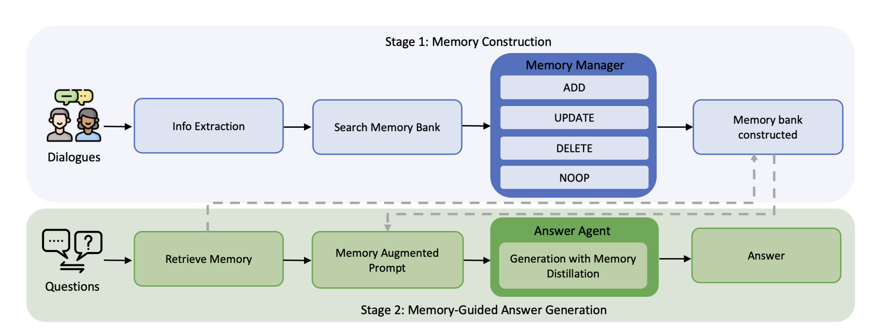
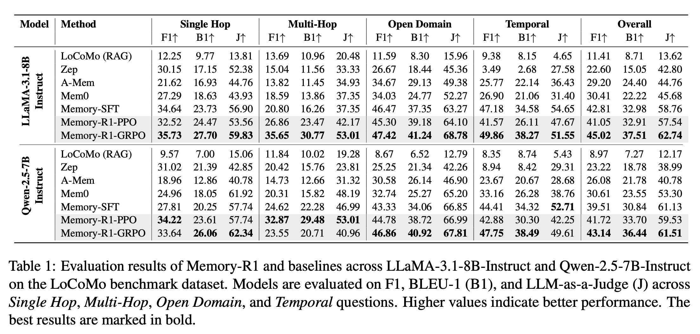
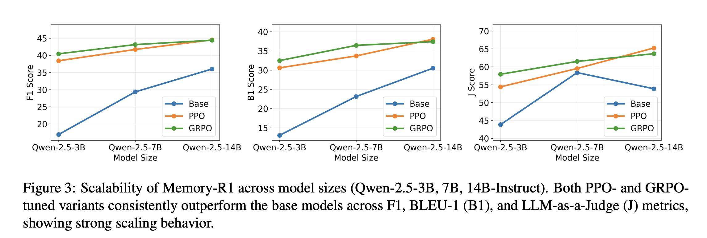
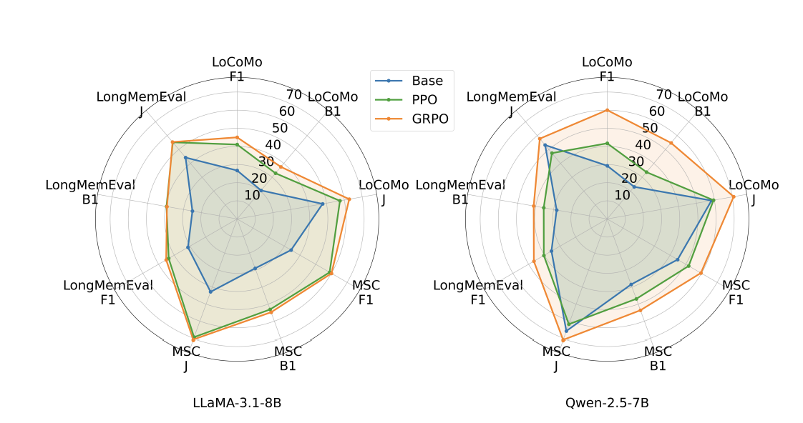

# Memory-R1：通过强化学习增强大型语言模型智能体管理和利用记忆

## 论文信息

- **论文标题**: Memory-R1: Enhancing Large Language Model Agents to Manage and Utilize Memories via Reinforcement Learning
- **作者**: Sikuan Yan, Xiufeng Yang, Zuchao Huang 等12位作者
- **发表年份**: 2025年
- **机构**: 多个研究机构合作
- **论文链接**: https://arxiv.org/abs/2508.19828
- **arXiv编号**: 2508.19828v3

## 摘要

大型语言模型（LLMs）在广泛的自然语言处理任务中展现了令人印象深刻的能力，但它们本质上是无状态的，受限于有限的上下文窗口，这阻碍了长期推理能力。最近的努力通过外部记忆库来增强LLMs以解决这一限制，但大多数现有的管道是静态的、启发式驱动的，缺乏学习机制来决定存储、更新或检索什么内容。

本文提出了Memory-R1，这是一个强化学习（RL）框架，通过两个专门的智能体为LLMs配备主动管理和利用外部记忆的能力：记忆管理器（Memory Manager）学习执行结构化的记忆操作（ADD、UPDATE、DELETE、NOOP），以及答案智能体（Answer Agent）预选择相关条目并对其进行推理以产生答案。

这两个代理都使用结果导向的强化学习（PPO 和 GRPO）进行微调，从而实现自适应内存管理，只需极少量的监督。**仅使用 152 个训练 QA 对**，Memory-R1 就优于强大的基线，并在多种模型规模（3B–14B）上泛化到不同的题型、三个基准（LoCoMo、MSC、LongMemEval）中。

## 核心贡献与创新点

### 1. 双智能体架构设计
- **记忆管理器（Memory Manager）**: 负责学习如何执行结构化的记忆操作，包括添加（ADD）、更新（UPDATE）、删除（DELETE）和无操作（NOOP）四种基本操作
- **答案智能体（Answer Agent）**: 负责从记忆库中预选择最相关的条目，并基于这些条目进行推理生成答案

### 2. 强化学习驱动的记忆管理
- 突破了传统静态、启发式驱动的记忆管理方式
- 通过强化学习让模型自主学习何时存储、更新或检索记忆内容
- 采用PPO（Proximal Policy Optimization）和GRPO（Group Relative Policy Optimization）等RL算法进行训练

### 3. 动态记忆操作机制
- 不再依赖预设的规则或启发式方法
- 模型能够根据上下文和任务需求动态决定记忆操作
- 实现了更精确和有效的长期记忆管理

### 4. 跨模型架构的通用性
- 在不同的LLM骨干网络上都展现了一致的性能提升
- 证明了强化学习方法在记忆管理方面的架构无关性

## 方法论与技术细节

### 系统架构
Memory-R1框架采用双智能体设计，将记忆管理和答案生成分离为两个独立但协作的组件：



#### 记忆管理器（Memory Manager）
- **功能**: 负责决定对外部记忆库执行何种操作
- **操作类型**: 
  - ADD: 向记忆库添加新的信息条目
  - UPDATE: 更新现有记忆条目的内容
  - DELETE: 删除过时或不相关的记忆条目
  - NOOP: 不执行任何操作
- **训练方式**: 通过强化学习训练，基于下游任务的性能反馈优化决策

#### 答案智能体（Answer Agent）
- **功能**: 从记忆库中检索相关信息并生成最终答案
- **工作流程**: 
  1. 预选择与当前查询最相关的记忆条目
  2. 对选中的条目进行推理和整合
  3. 生成基于记忆内容的答案

### 训练方法详解

#### 记忆管理器的强化学习训练

##### 任务建模
记忆管理器被建模为一个策略π_θ，接收提取的信息x和当前记忆库M_old作为输入，输出操作o和更新内容m'：

```
(o, m') ~ π_θ(·|x, M_old)
```

训练目标是学习哪种操作能产生最佳的记忆状态，使答案智能体能够正确回答问题。

##### PPO训练策略
采用近端策略优化（PPO）算法训练记忆管理器：

1. **策略采样**: 给定候选记忆x和记忆库M_old，管理器从策略π_θ中采样操作o和更新内容m'
2. **奖励获取**: 将操作应用到记忆库后，传递给冻结的答案智能体，根据答案正确性获得标量奖励r
3. **优势估计**: 从奖励r中估计优势A
4. **目标函数**: 使用裁剪的PPO目标函数进行优化

##### GRPO训练策略
同时采用群体相对策略优化（GRPO）作为替代训练方法：

1. **群体采样**: 对每个状态采样G个候选动作
2. **相对优势**: 计算群体内的相对优势，避免显式价值函数
3. **稳定性**: 通过KL散度正则化防止策略偏移

##### 奖励设计
采用结果驱动的奖励机制：
```
R_answer = EM(y_pred, y_gold)
```
其中EM表示精确匹配分数，y_pred是预测答案，y_gold是真实答案。这种设计无需人工标注，具有良好的可扩展性。

#### 答案智能体的强化学习训练

##### 任务建模
答案智能体被建模为策略π_ans，将问题q和检索到的记忆集合M_ret映射为答案y：

```
y ~ π_ans(·|q, M_ret)
```

##### 训练流程
1. **记忆检索**: 通过基于相似性的RAG检索60个候选记忆
2. **记忆蒸馏**: 选择最相关的条目
3. **答案生成**: 基于选中的记忆生成答案

##### PPO和GRPO训练
答案智能体采用与记忆管理器相同的PPO和GRPO算法：
- **PPO**: 使用重要性比率和优势估计进行策略更新
- **GRPO**: 对每个(q, M_ret)采样G个候选答案，计算群体相对优势

##### 奖励设计
同样使用精确匹配分数作为奖励：
```
R_answer = EM(y_pred, y_gold)
```
直接将奖励与最终答案的正确性关联，鼓励智能体以产生准确输出的方式选择和推理记忆。

### 记忆库设计
- **结构化存储**: 采用结构化的方式存储记忆条目
- **动态管理**: 支持实时的增删改查操作
- **相关性评估**: 内置机制评估记忆条目与当前任务的相关性

## 实验结果与性能评估



### 主要评估指标
论文采用了多个评估指标来衡量Memory-R1的性能：
- **F1分数**: 整体性能的综合评估
- **B1分数**: 特定任务的准确性评估  
- **J分数**: 记忆管理质量的评估

### 强化学习训练效果
根据实验结果，强化学习训练显著提升了系统性能：





### 跨架构一致性验证
实验在两个不同的LLM骨干网络上进行了验证，结果显示：
- 强化学习方法在不同模型架构上都实现了一致的性能提升
- 证明了Memory-R1框架的通用性和鲁棒性
- 验证了基于结果的强化学习能够让记忆管理器执行更准确和有效的操作

### 与传统方法对比
相比传统的静态、启发式记忆管理方法：
- Memory-R1在长期对话场景中表现更优
- 能够更准确地识别和处理记忆更新需求
- 在多轮对话中保持更好的上下文一致性

## 总结

Memory-R1论文提出了一个创新的强化学习框架，通过双智能体架构有效解决了大型语言模型在长期记忆管理方面的挑战。<mcreference link="https://arxiv.org/abs/2508.19828" index="1">1</mcreference> 该方法不仅在技术上实现了突破，将静态的启发式记忆管理转变为动态的学习式管理，<mcreference link="https://arxiv.org/html/2508.19828v1" index="4">4</mcreference> 而且在实验验证中展现了显著的性能提升和跨架构的通用性。<mcreference link="https://arxiv.org/html/2508.19828v1" index="4">4</mcreference> 

这项工作为构建更智能、更具适应性的AI系统提供了重要的技术基础，特别是在需要长期记忆和上下文理解的应用场景中具有重要价值。随着技术的进一步发展和优化，Memory-R1有望成为下一代智能对话系统和知识管理系统的核心技术之一。
