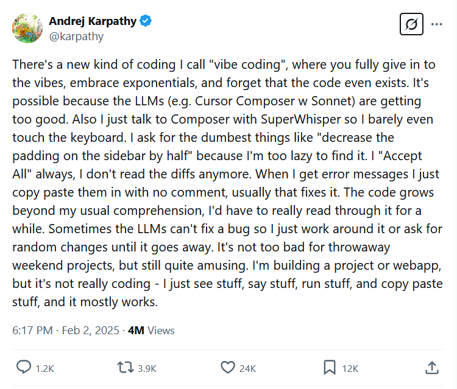

# Vibe Coding 简介

## 什么是 Vibe Coding

Vibe Coding 是一种革命性的AI辅助软件开发概念，代表着编程范式的根本性转变。它是一种新型的编程方式，开发者完全信任AI，甚至不阅读生成的代码，只是"跟随感觉"进行开发。

根据Andrej Karpathy的原始定义，Vibe Coding的核心特征是：

- **完全依赖AI**：开发者"完全顺应直觉，拥抱指数式发展，忘记代码的存在"
- **自然语言交互**：通过日常语言与AI对话，描述想要实现的功能
- **不阅读代码**：开发者不再仔细审查AI生成的代码差异（diffs）
- **快速迭代**：当遇到错误时，直接复制粘贴错误信息给AI，通常就能解决问题
- **超越理解范围**：代码的复杂性可能超出开发者的常规理解范围
- **问题导向**：专注于解决问题而非技术实现细节

正如Karpathy所说："我构建项目或网络应用，但这并不是真正的编程——我只是看东西、说东西、运行东西、复制粘贴东西，然后大部分都能工作。"

### Vibe Coding vs 传统AI辅助编程

需要注意的是，Vibe Coding并不等同于所有AI辅助编程。专业的软件开发中，开发者仍需要：
- 审查AI生成的代码
- 确保代码的安全性和性能
- 理解代码的工作原理
- 考虑可维护性和团队协作

Vibe Coding更适用于低风险的项目、快速原型开发和个人工具创建。

## Vibe Coding 的出处

Vibe Coding 这一概念由知名计算机科学家 **Andrej Karpathy** 在 **2025年2月6日** 首次提出并推广。Karpathy 是人工智能领域的权威专家，曾任Tesla自动驾驶AI总监，现任OpenAI联合创始人。

### 原始推文

他在2025年2月6日的推文中完整地描述了Vibe Coding：

> "有一种新的编程方式，我称之为'Vibe Coding'，你完全顺应直觉，拥抱指数式发展，甚至忘记代码的存在。这是可能的，因为大语言模型（例如Cursor Composer配合Sonnet）变得太好了。而且我只是通过SuperWhisper与Composer对话，所以我几乎不需要触摸键盘。
> 
> 我会要求最愚蠢的事情，比如'将侧边栏的内边距减少一半'，因为我太懒得去找它。我总是'全部接受'，我不再阅读差异。当我遇到错误信息时，我只是复制粘贴它们，不加任何评论，通常这就能修复它。代码增长超出了我通常的理解范围，我需要花时间仔细阅读才能理解。有时大语言模型无法修复一个错误，所以我只是绕过它或要求随机更改，直到它消失。
> 
> 对于一次性的周末项目来说还不错，但仍然很有趣。我在构建项目或网络应用，但这不是真正的编程——我只是看东西、说东西、运行东西、复制粘贴东西，大部分都能工作。"

### 概念的快速传播

这一概念在技术社区引起了巨大轰动：

- **媒体报道**：在短短几周内被《纽约时报》、Ars Technica、《卫报》等主流媒体报道
- **学术认可**：在推文发布一个月后，"Vibe Coding"就被加入到《韦氏词典》作为"俚语和趋势"术语
- **产业影响**：在Y Combinator等创业孵化器环境中得到广泛应用
- **维基百科收录**：概念被收录到维基百科，表明其重要性和影响力

### 背景和时机

这一概念的提出恰逢AI技术的关键发展期：
- **大语言模型成熟**：ChatGPT、Claude和OpenAI Codex等工具达到了足够的能力水平
- **开发工具进化**：Cursor、Replit等AI原生开发工具的兴起
- **产业需求**：快速原型开发和低代码解决方案的市场需求增长

## 目前 Vibe Coding 的流行工具

随着Vibe Coding概念的兴起，2025年涌现出众多专门支持这种编程方式的AI工具。

### 主要Vibe Coding工具

- **Cursor IDE**: AI原生代码编辑器，多文件编辑和全代码库理解
- **GitHub Copilot**: 微软AI编程助手，实时代码补全和多语言支持
- **Windsurf**: 免费AI原生IDE，适合初学者
- **Claude Code**: 基于终端的AI编程助手

## Vibe Coding 的应用场景

1. **快速原型开发**：创业公司利用Vibe Coding快速验证产品概念
2. **非技术人员编程**：让没有编程背景的人也能创建应用程序
3. **教育培训**：帮助编程初学者理解代码结构和逻辑
4. **复杂项目重构**：AI协助进行大规模代码重构和优化

## 发展前景

Vibe Coding 正在推动软件开发的范式转变，从传统的手动编码向AI辅助的智能开发演进。随着AI技术的不断进步，预计将出现更多创新功能：

- **多模态编程**：结合语音、视觉和文本的编程接口
- **更智能的上下文理解**：AI能更好地理解项目整体架构
- **自动化测试和部署**：AI不仅生成代码，还能处理测试和部署流程
- **协作式开发**：多个AI助手协同工作，处理复杂项目

Vibe Coding 代表着编程的未来，它不是要替代程序员，而是要释放开发者的创造力，让他们专注于解决问题和创新，而非繁琐的语法细节。随着这一技术的成熟，我们可以期待看到更多令人惊叹的应用和创新。